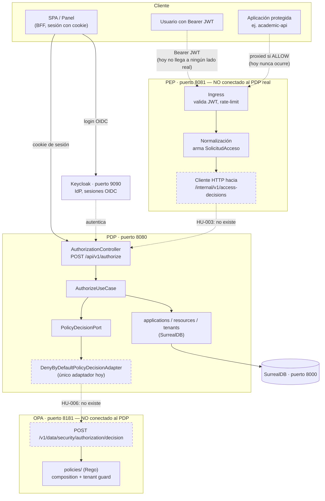
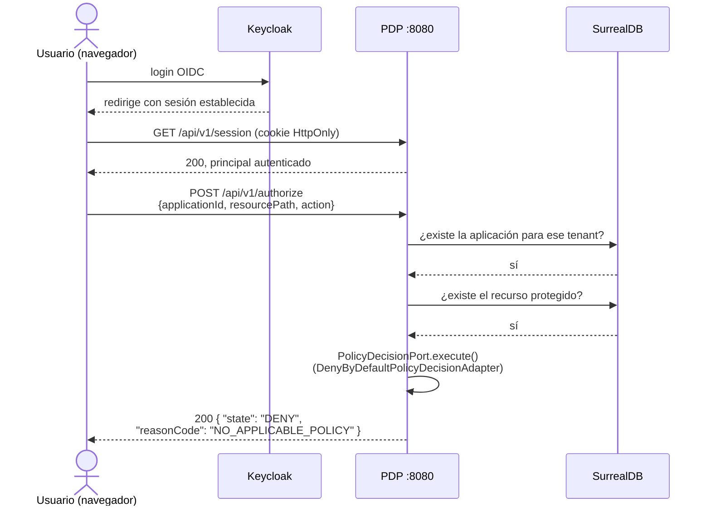
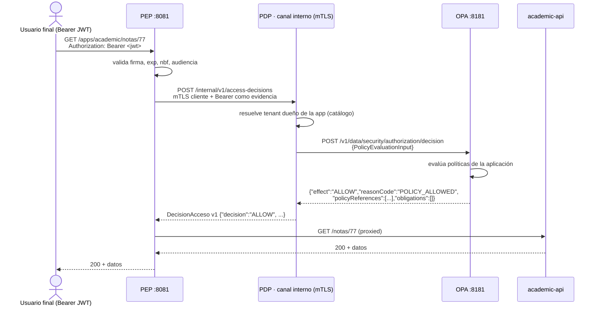

# La Plataforma Central de Seguridad — mapa completo

> Este documento es el único que describe **los tres componentes juntos** (PDP, PEP, OPA). Cada uno
> tiene su propia documentación profunda —[`pdp/docs/README.md`](../pdp/docs/README.md) para el PDP,
> [`../pep/README.md`](../pep/README.md) para el PEP,
> [`../security-policy-engine/README.md`](../security-policy-engine/README.md) para OPA— pero
> ninguno de los tres, por sí solo, explica cómo encajan. Este sí.
>
> **Estado: 2026-09-11.** Marca explícitamente qué corre hoy y qué es plan, porque confundir las dos
> cosas fue el fallo histórico de este proyecto (ver `pdp/docs/criteria-compliance-matrix.md`, hallazgo
> transversal). Cuando algo cambie de estado, este documento se actualiza en el mismo commit.

---

## 1. Los tres componentes, en una tabla

| Componente | Qué es | Dónde vive | Quién lo lleva | Estado |
|---|---|---|---|---|
| **PDP** — Policy Decision Point | El servicio que decide: dado un sujeto, una aplicación, un recurso y una acción, ¿se permite? | [`pdp/`](../pdp/) | Sebastián | 🟢 En producción de desarrollo. Decide con **denegación por defecto** — todavía no consulta una política real |
| **PEP** — Policy Enforcement Point | El proxy que se pone delante de cada aplicación protegida: valida el JWT del usuario, pregunta al PDP y solo deja pasar la petición si la respuesta es `ALLOW` | [`pep/`](../pep/) | David | 🟡 Implementado y probado contra un PDP **simulado** (fixtures). Su cliente real apunta a un endpoint del PDP que **todavía no existe** (HU-003) |
| **OPA** — Open Policy Agent / motor de políticas | El que de verdad evalúa la política: recibe hechos del PDP y devuelve una decisión lógica en Rego | [`security-policy-engine/`](../security-policy-engine/) | Laura | 🟡 El motor y sus políticas core están implementados y probados. **Nada lo llama todavía** — el PDP no tiene un adaptador que lo consuma (HU-006) |

Los tres viven en **un solo repositorio** (`securityBaseline`), cada uno en su propio árbol de
primer nivel, con su propio build (`pdp/pom.xml` y `pep/pom.xml` son independientes entre sí — el
`mvnw` de la raíz se invoca con `-f` hacia cada uno; OPA no usa Maven en absoluto). No se pisan y
no comparten código — se pisan solo en los **contratos**, que viven en
[`contracts/`](../contracts/README.md) desde la unificación del 2026-09-10.

---

## 2. Diagrama de contenedores — lo que existe hoy



**Lectura del diagrama:** las líneas punteadas son las que **no existen todavía**. Hoy el PDP y el
PEP son dos islas que comparten un contrato escrito pero ningún tráfico real; lo mismo entre el PDP
y OPA. Lo único que corre de punta a punta hoy es la columna izquierda: SPA → Keycloak → PDP →
SurrealDB.

---

## 3. Qué hace cada contenedor, en la práctica

### PDP (puerto 8080)

Es un Spring Boot **reactivo** (WebFlux) organizado en módulos Spring Modulith
(`pdp/tenants`, `pdp/applications`, `pdp/resources`, `pdp/identity`, `pdp/authorization`). Guarda
todo en SurrealDB por HTTP, sin ORM.

**Ejemplo práctico — registrar una aplicación y consultarla:**

```bash
# 1. Levantar la infraestructura del PDP
docker compose -f pdp/docker-compose.yml up -d surrealdb keycloak
SPRING_PROFILES_ACTIVE=keycloak ./mvnw -f pdp/pom.xml spring-boot:run

# 2. Con una sesión ya autenticada (cookie JSESSIONID de Keycloak), registrar una aplicación
curl -i -b cookies.txt -c cookies.txt -X POST http://localhost:8080/api/v1/tenants \
  -H "Content-Type: application/json" \
  -d '{"name": "universidad-uco"}'

curl -i -b cookies.txt -X POST http://localhost:8080/api/v1/applications \
  -H "Content-Type: application/json" \
  -d '{"name": "academic-api", "baseUrl": "https://academic.internal"}'

# 3. Pedirle al PDP una decisión de acceso (canal BFF, HU-002)
curl -i -b cookies.txt -X POST http://localhost:8080/api/v1/authorize \
  -H "Content-Type: application/json" \
  -d '{"applicationId": "<uuid-de-la-app>", "resourcePath": "/notas", "action": "GET"}'
```

La última llamada **siempre responde `DENY / NO_APPLICABLE_POLICY`** hoy — es correcto, no un bug:
`DenyByDefaultPolicyDecisionAdapter` es el único adaptador de `PolicyDecisionPort` que existe
(`pdp/src/main/java/co/edu/uco/seguridad/pdp/authorization/infrastructure/adapter/secondary/policy/DenyByDefaultPolicyDecisionAdapter.java`).
Ver [`pdp/docs/ai-harness/workspace/ROADMAP-PDP.md`](../pdp/docs/ai-harness/workspace/ROADMAP-PDP.md#por-qué-hu-002-deniega-a-propósito).

### PEP (puerto 8081)

Un proxy inverso independiente, Spring Boot WebFlux, con su propio `pom.xml`. No conoce nada del
PDP más allá del contrato HTTP (`contracts/pep-pdp/v1/`). Valida el JWT Bearer del usuario final,
arma una `SolicitudAcceso` y solo reenvía la petición al backend real si el PDP responde `ALLOW`.

**Ejemplo práctico — demo con servidores simulados (lo único que corre hoy):**

```bash
# Terminal 1: simulador de PDP + backend de prueba, en 18080/18081
java -cp 'pep/target/test-classes:pep/target/classes:pep/target/dependency/*' \
  co.edu.uco.seguridad.pep.fixture.FixtureServers

# Terminal 2: el PEP de verdad, en 8081
java -jar pep/target/security-pep-0.1.0-SNAPSHOT.jar \
  --spring.config.additional-location=file:./pep/config/local.properties

# Terminal 3: pedir un recurso protegido
TOKEN=$(curl -fsS http://127.0.0.1:18080/token)
curl -i -H "Authorization: Bearer $TOKEN" http://localhost:8081/apps/demo/notes/77
#   -> 200, el PEP reenvió porque el simulador respondió ALLOW

curl -fsS http://127.0.0.1:18080/__fixture/mode/DENY
curl -i -H "Authorization: Bearer $TOKEN" http://localhost:8081/apps/demo/notes/77
#   -> 403, el PEP bloqueó sin tocar el backend
```

**Lo que falta para que esto sea real:** cambiar `pep.pdp.base-url` de `http://fixtures:18080` (el
simulador) a la URL del PDP de verdad, sobre `POST /internal/v1/access-decisions` — que hoy **no
existe en el PDP**. Es exactamente HU-003.

### OPA (puerto 8181)

Un contenedor con el binario oficial de Open Policy Agent y las políticas Rego del proyecto
montadas encima. No tiene estado propio ni base de datos: cada petición es una evaluación pura de
los hechos que recibe.

**Ejemplo práctico — evaluar una decisión a mano:**

```bash
cd security-policy-engine
docker compose up --build   # queda en localhost:8181

jq -n --slurpfile input ../contracts/pdp-opa/v1/examples/valid/minimal-same-tenant.json \
  '{input: $input[0]}' | \
curl -X POST http://localhost:8181/v1/data/security/authorization/decision \
  -H 'content-type: application/json' --data-binary @-
```

Sin ninguna política de aplicación registrada bajo `policies/applications/`, la respuesta siempre es:

```json
{"result":{"effect":"DENY","reasonCode":"NO_APPLICABLE_POLICY",
  "policyReferences":[{"id":"core.composition","version":"1.0"}],"obligations":[]}}
```

Eso es correcto por diseño (`security-policy-engine/README.md`): el motor core nunca inventa una
política de negocio, y sin una la respuesta es una denegación explícita, no un error.

### Keycloak (puerto 9090→8080) y SurrealDB (puerto 8000)

Infraestructura de soporte del PDP, ya wireada en [`pdp/docker-compose.yml`](../pdp/docker-compose.yml). Keycloak es el
IdP real del panel (login OIDC, patrón BFF con cookie HttpOnly); SurrealDB es donde vive el catálogo
(`tenants`, `applications`, `resources`, `identity`). Ninguno de los dos lo usa el PEP ni OPA
directamente.

---

## 4. Flujo de una petición — HOY (lo único que funciona de punta a punta)



**El tenant nunca sale del cuerpo ni de la query** (ADR-018): sale del principal autenticado por
Keycloak. Y la respuesta es siempre `DENY` porque todavía no hay política — es honesto, no un
placeholder (ver §3, PDP).

---

## 5. Flujo de una petición — OBJETIVO (lo que HU-003 + HU-006 desbloquean)



**Lo que cambia frente a hoy:** dos saltos nuevos (PEP→PDP interno, PDP→OPA) y una decisión real en
vez de una denegación fija. Cada pieza de esta cadena —el schema del canal interno, el modelo de
`PolicyEvaluationInput`, el vocabulario de `reasonCode`, las obligaciones— ya está **acordada y
verificada** en [`contracts/`](../contracts/README.md); lo que falta es el código que la conecte.

---

## 6. Prioridades — qué hacer primero y por qué

> Fuente completa, con el detalle de cada decisión pendiente:
> [`ROADMAP-PDP.md`](../pdp/docs/ai-harness/workspace/ROADMAP-PDP.md). Esta tabla es el resumen ejecutable.

| # | Qué | Por qué va antes que las demás | Sin esto, no se puede… |
|---|---|---|---|
| **1** | **HU-003** — endpoint interno `POST /internal/v1/access-decisions` con mTLS + Bearer, según `contracts/pep-pdp/v1/` | Es el **único** de los pendientes que desbloquea a otra persona del equipo. El PEP de David está terminado y probado; solo le falta un PDP real contra el cual hablar | Probar el PEP con tráfico real. Todo lo que hace el PEP hoy es contra un simulador |
| **2** | **HU-004** — catálogo de roles (BC-04): alcance tenant/aplicación/global y recursos que autoriza | Primera mitad del valor propio del PDP. Partida de la historia original de roles+asignaciones el 2026-09-11 porque, con esas decisiones, cada mitad es del tamaño de HU-003 | Que exista vocabulario de roles que asignar |
| **3** | **HU-005** — asignaciones vigentes (BC-08): `UsuarioAplicacionRol` + `Vigencia` + `findActiveRolesFor` | Sin atributos que evaluar, conectar OPA no cambiaría nada: seguiría respondiendo `NO_APPLICABLE_POLICY` porque no hay hechos de negocio que darle | Que una política Rego tenga algo real que decidir |
| **4** | **HU-006** — adaptador `OpaPolicyDecisionAdapter` sobre `PolicyDecisionPort` | Sustituye `DenyByDefaultPolicyDecisionAdapter` por una llamada real a OPA. Con esto se cierra el camino `ALLOW`, que hoy es matemáticamente imposible | Que el PDP alguna vez responda `ALLOW` |
| **5** | **HU-007** — `EventoAcceso` correlacionado hacia auditoría | Sin evidencia durable no hay cumplimiento (INV-AUD-01) — pero no bloquea a nadie del equipo, a diferencia de 1-4 | Demostrar qué se decidió y por qué, después del hecho |
| **6** | **HU-009** — administración de seguridad por aplicación (quién administra el catálogo) | Diferida desde HU-004/HU-005 a propósito. Desbloquea los roles globales por HTTP y es el modelo que el microfrontend necesita. Necesita ADR antes | El microfrontend de seguridad |
| — | `pep-pdp/v1.1` — obligaciones como objetos, no strings | Es de David; el contrato en `contracts/obligations.md` ya dice qué tiene que hacer | Que un `ALLOW` con obligación `AUDIT` no se sirva sin auditar (hoy degrada a `INDETERMINATE`, correcto pero conservador) |
| — | Registrar `ci/pep-pipeline.yml` en Azure | El módulo `pep/` no tiene CI propio corriendo todavía | Que un cambio en `pep/` se verifique solo, sin depender de que alguien corra `mvnw -f pep/pom.xml verify` a mano |

**La regla que atraviesa todo esto** (textual del roadmap): *ni un solo `if (rol == ...)` en un caso
de uso o un controlador.* Roles y perfiles no desaparecen — dejan de ser lógica de decisión y pasan
a ser atributos de entrada que evalúa OPA.

### Lo que NO hay que hacer todavía

- Diseño de auditoría durable (Etapa 4 del plan del PEP) — después de HU-006.
- Despliegue en red / TLS por ambiente / `X-ARR-ClientCert` de App Service — es un problema de
  infraestructura, no del PDP (ver `HANDOFF-INTEGRACION-PEP-OPA.md`, trampa T3).
- Validación de issuer/audiencia **por aplicación** — aplazada a propósito (decisión D5 del
  handoff); hoy se valida contra un conjunto de confianza configurado, y es deuda consciente. Al
  partir roles/asignaciones el 2026-09-11 quedó **sin historia numerada**: es «credenciales por
  aplicación», emparentada con HU-009 y con la librería v1 (los dos registros de aplicaciones que
  no se hablan). Necesita su propia historia cuando se decida dónde vive la credencial.

---

## 7. Cómo levantar cada pieza — comandos, no repetición

Este documento no repite las instrucciones de arranque de cada componente porque ya existen y son
correctas; las enlaza:

| Componente | Instrucciones completas |
|---|---|
| PDP | [`../CLAUDE.md`](../CLAUDE.md) §"Arrancar en local" |
| PEP | [`../pep/README.md`](../pep/README.md) §"Demostración con procesos separados" |
| OPA | [`../security-policy-engine/README.md`](../security-policy-engine/README.md) §"Inicio local" |

**No existe hoy un `docker compose up` único que levante los cinco contenedores juntos**, porque
levantarlos juntos no demostraría nada todavía: el PEP hablaría con su simulador (no con el PDP) y
OPA no recibiría tráfico de nadie. Ese compose unificado tiene sentido **después** de HU-003 y
HU-006 — antes, sería un compose unico que aparenta una integración que no existe, que es
justo el tipo de deriva que este proyecto existe para evitar (ver hallazgo transversal en
`pdp/docs/criteria-compliance-matrix.md`).

---

## 8. Dónde está cada cosa

| Qué necesitas | Dónde |
|---|---|
| Cómo trabajar una historia con el harness de agentes | [`../.claude/README.md`](../.claude/README.md) |
| El estado detallado, historia por historia | [`ai-harness/CHECKPOINT.md`](../pdp/docs/ai-harness/CHECKPOINT.md) |
| Las decisiones de diseño de HU-003, con lo descartado y por qué | [`ai-harness/workspace/HANDOFF-INTEGRACION-PEP-OPA.md`](../pdp/docs/ai-harness/workspace/HANDOFF-INTEGRACION-PEP-OPA.md) |
| Las cuatro decisiones que unificaron los contratos de PDP, PEP y OPA | [`../contracts/README.md`](../contracts/README.md) |
| El vocabulario único de `reasonCode` | [`../contracts/reason-codes.md`](../contracts/reason-codes.md) |
| El diagnóstico completo de las desalineaciones (antes de resolverlas) | [`ai-harness/workspace/INTEGRACION-PDP-PEP-OPA.md`](../pdp/docs/ai-harness/workspace/INTEGRACION-PDP-PEP-OPA.md) |
| Los 23 criterios de la línea base y su evidencia | [`pdp/docs/README.md`](../pdp/docs/README.md) |
