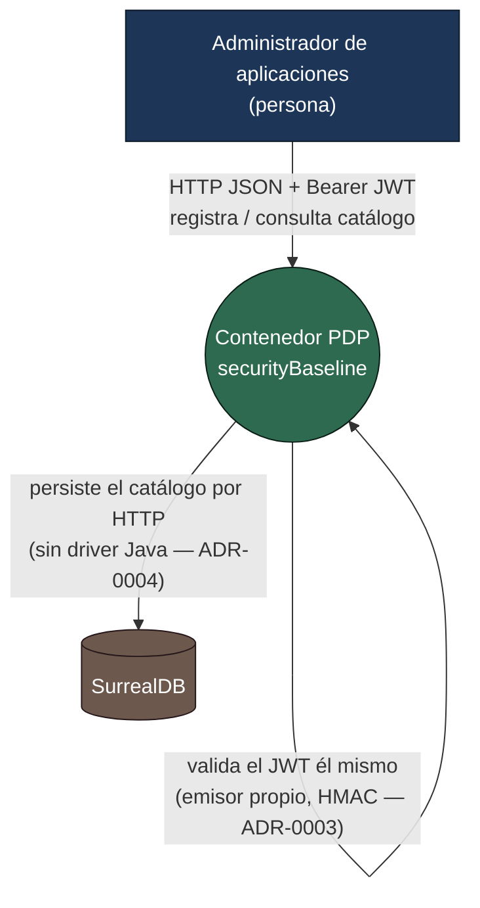
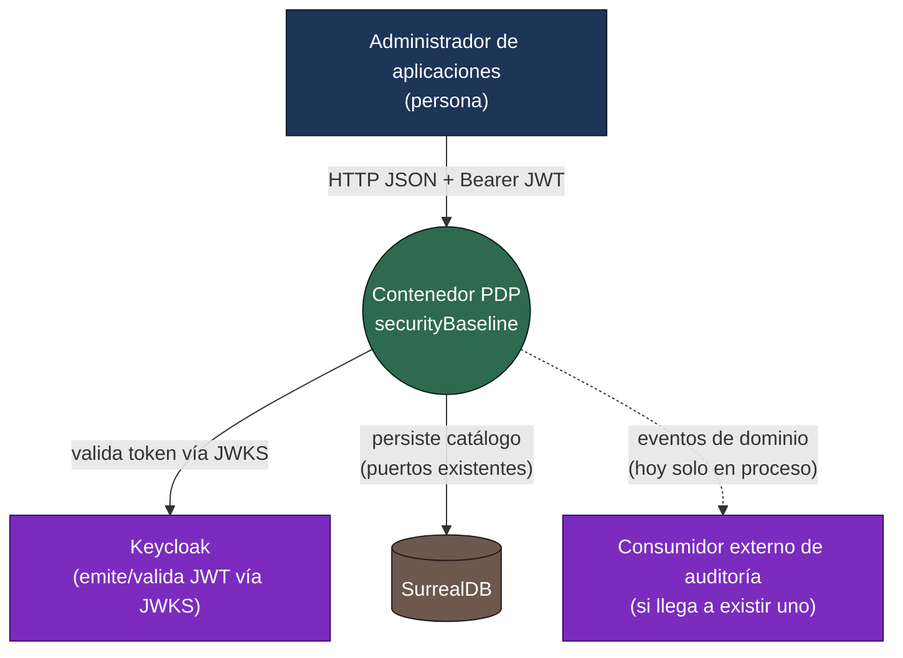
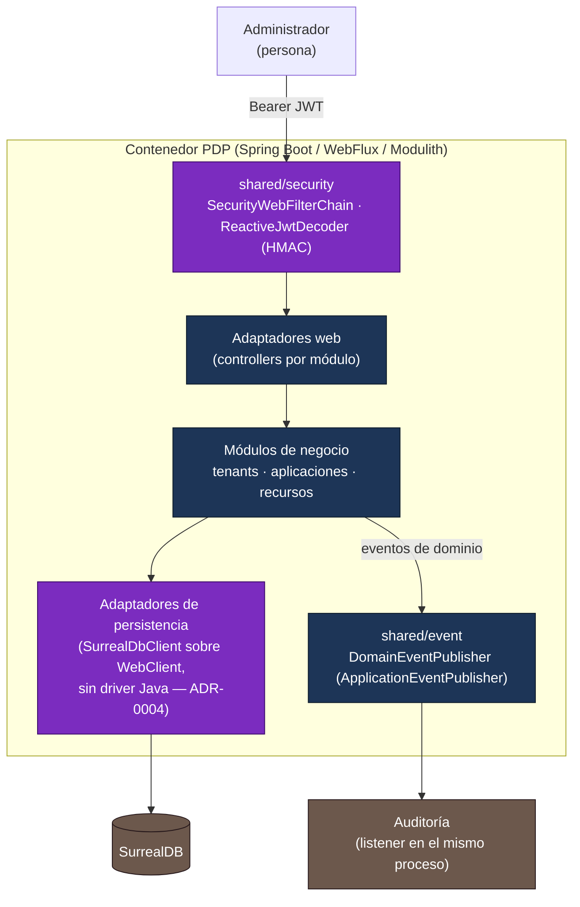

# Diagramas C4

[← Arquitectura](../README.md) · [Gobierno (ADR)](../../governance/README.md)

Dos niveles C4 (Contexto y Contenedor), cada uno en dos versiones: **estado actual** (lo que corre
hoy: autenticación real con emisor propio, persistencia real en SurrealDB) y **evolución prevista**
(lo que resulta de reemplazar el emisor propio por Keycloak y, si llega a existir, un consumidor
externo de auditoría). Los componentes nuevos se marcan explícitamente; nada del estado actual se
elimina de golpe, se sustituye por etapa (ver
[arquitectura y hoja de ruta](../../plans/2026-08-07-architecture-and-roadmap.md)).

## Nivel 1 — Contexto (estado actual)

El contenedor PDP ya exige y valida autenticación (ADR-0003) y ya persiste en una base de datos real
(ADR-0004), pero todavía sin un proveedor de identidad externo: el propio contenedor firma y valida
sus JWT con una clave compartida. La auditoría sigue detrás de un puerto con implementación dummy en
memoria (solo identificadores, nunca el payload).

## Nivel 1 — Contexto (evolución prevista)

`IDP` (Keycloak) es evolución prevista, no estado actual: sustituiría el `ReactiveJwtDecoder` HMAC de
hoy sin que el dominio ni los casos de uso cambien (ADR-0003) — el cambio sería
`.withSecretKey(...)` → `.withJwkSetUri(...)` en `SecurityConfiguration`. `DB` (SurrealDB) ya es
estado actual desde ADR-0004, no evolución prevista; se mantiene en este diagrama sin resaltar porque
no cambia entre ambas versiones. `AUD` como *sistema externo* sigue siendo hipotético — hoy la
auditoría es un listener en el mismo proceso (`InMemoryAuditAdapter`), no un sistema aparte; se
dibuja aquí solo para mostrar que el mecanismo de eventos ya lo permitiría el día que uno exista.

## Nivel 2 — Contenedor (estado actual, con lo nuevo desde ADR-0003/ADR-0004 marcado)

`SEC` es lo que añadió la etapa 3: valida el JWT y expone el principal autenticado
(`SecurityContext.currentPrincipal()`) a los interactores de `recursos`, que ya no aceptan el
tenant como parámetro del cuerpo o la query. `PERSIST` es lo que añadió la etapa 4: los tres
repositorios secundarios (`tenants`, `aplicaciones`, `recursos`) hablan con SurrealDB por HTTP a
través de un cliente compartido, sin driver Java de terceros — no había uno viable (ver la
[nota de implementación de ADR-0004](../../governance/adr/adr-0004-real-persistence-surrealdb.md#nota-de-implementación)).

El diagrama de contenedor específico de `securityBaseline` — con los módulos Modulith, sus
dependencias internas y el flujo E-1 completo — está en el
[arquitectura y hoja de ruta](../../plans/2026-08-07-architecture-and-roadmap.md).
Este documento se limita al nivel C4 de contexto y contenedor; el detalle de paquetes vive en
[Estructura PDP / Spring Modulith](../pdp-modulith-alignment.md).
