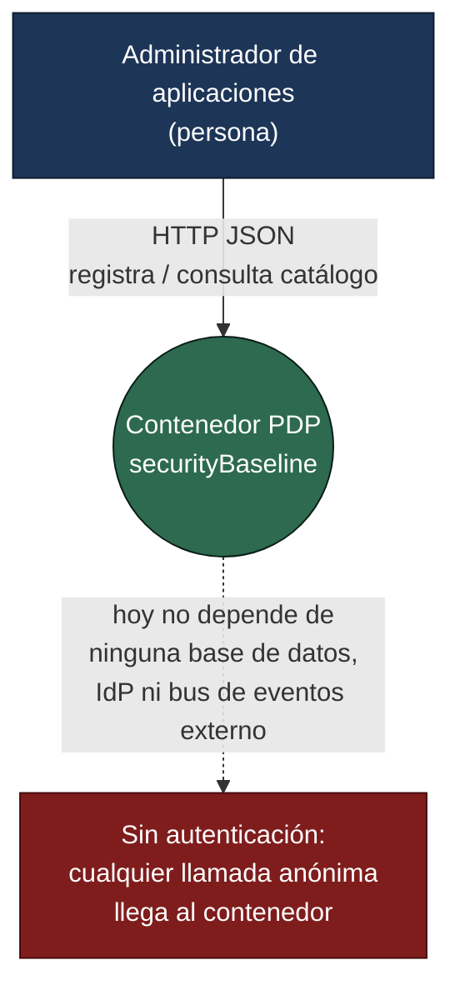
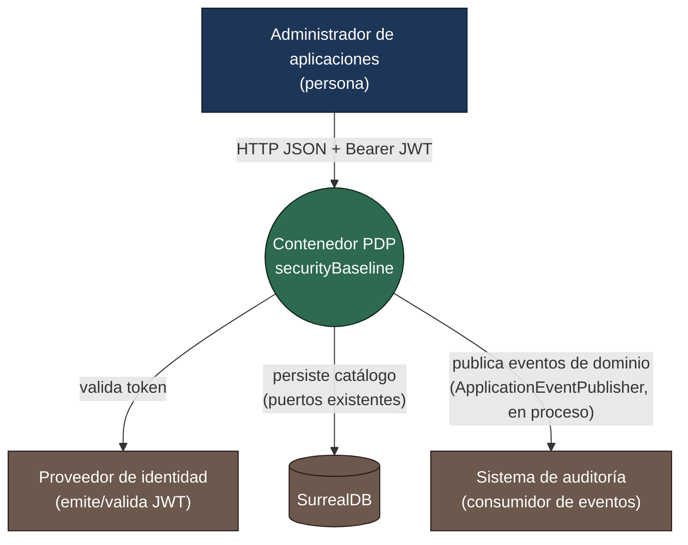
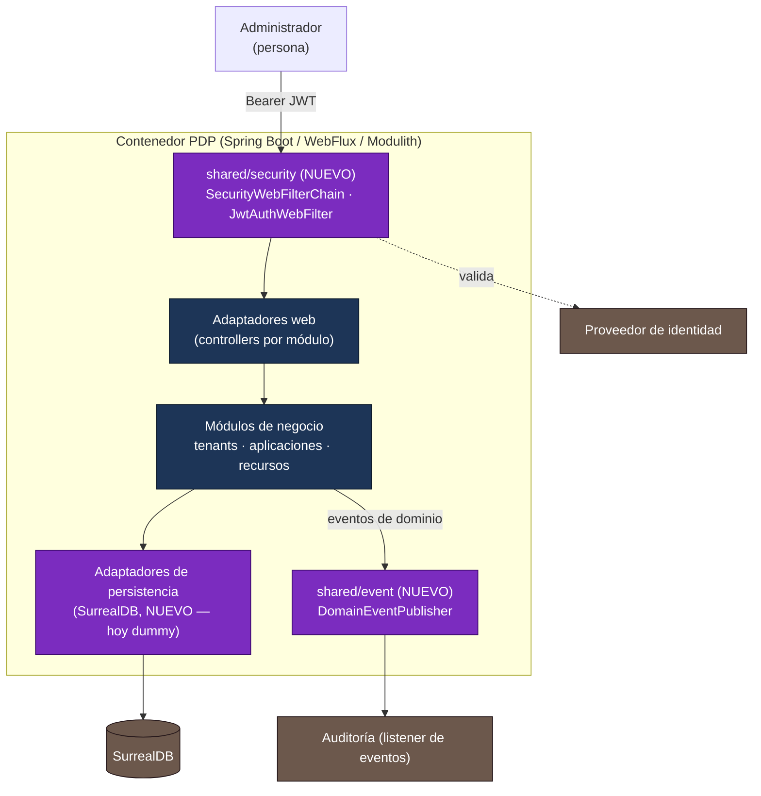

# Diagramas C4

[← Arquitectura](../README.md) · [Gobierno (ADR)](../../governance/README.md)

Dos niveles C4 (Contexto y Contenedor), cada uno en dos versiones: **estado actual** (lo que corre hoy,
con adaptadores dummy y sin autenticación) y **evolución prevista** (lo que resulta de aplicar
[ADR-0002](../../governance/adr/adr-0002-domain-events-modulith-registry.md),
[ADR-0003](../../governance/adr/adr-0003-real-security-reactive-jwt.md) y
[ADR-0004](../../governance/adr/adr-0004-real-persistence-surrealdb.md)). Los componentes nuevos se
marcan explícitamente; nada del estado actual se elimina de golpe, se sustituye por etapa (ver
[plan de implementación](../../plans)).

## Nivel 1 — Contexto (estado actual)

El contenedor PDP es, hoy, el único sistema: no hay IdP, base de datos ni bus de eventos reales detrás
de él — todo está detrás de puertos con implementación dummy en memoria.

## Nivel 1 — Contexto (evolución prevista)

Ningún actor ni sistema externo desaparece de golpe: `IDP`, `DB` y `AUD` se activan etapa por etapa
(Stage 3, Stage 4, Stage 2 respectivamente) sustituyendo un puerto ya existente, no añadiendo uno nuevo
al dominio.

`AUD` ya está activo: el Stage 2 se implementó, pero no exactamente como se planeó — el registro
persistente de eventos de Modulith necesita un almacén real que todavía no existe, así que la entrega
hoy es síncrona y en proceso (`ApplicationEventPublisher` puro), no vía el Event Publication Registry.
Ver la nota de implementación en [ADR-0002](../../governance/adr/adr-0002-domain-events-modulith-registry.md).

## Nivel 2 — Contenedor (evolución prevista, con lo nuevo marcado)

El diagrama de contenedor específico de `securityBaseline` — con los módulos Modulith, sus dependencias
internas y el flujo E-1 completo — está en el
[arquitectura y hoja de ruta](../../plans/2026-08-07-architecture-and-roadmap.md).
Este documento se limita al nivel C4 de contexto y contenedor; el detalle de paquetes vive en
[Estructura PDP / Spring Modulith](../pdp-modulith-alignment.md).
