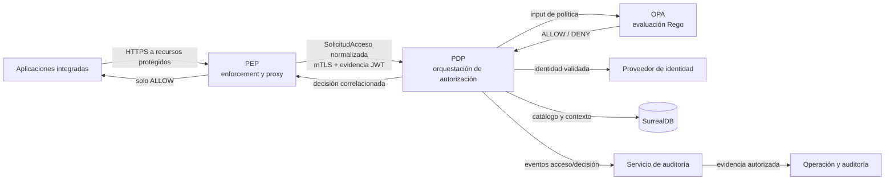

# Próximos pasos — Plataforma Central de Seguridad

**Fecha:** 2026-09-06

**Referencia de destino:** diagrama C4 Nivel 2 “Plataforma Central de Seguridad — MVP técnico”.
**Propósito:** convertir el estado actual del repositorio en la arquitectura objetivo sin confundir diseño con funcionalidad ya disponible.

## 1. Visión objetivo

La plataforma debe permitir que aplicaciones integradas soliciten acceso a recursos protegidos a través del PEP.
El PEP aplica, pero no calcula, la decisión. El PDP construye contexto confiable y obtiene la decisión de OPA;
identidades, tenants, aplicaciones, recursos y asignaciones se mantienen en SurrealDB. Decisión y acceso deben
producir evidencia consultable para operación y auditoría.

El backend protegido queda fuera de este diagrama lógico, pero es indispensable: debe ser privado y solo
alcanzable desde la red del PEP. De otro modo, una aplicación puede eludir el enforcement.

## 2. Estado actual frente al objetivo

| Elemento objetivo | Estado actual comprobado | Brecha |
|---|---|---|
| PEP reactivo | Implementado como proyecto autónomo WebFlux, con JWT, rutas, proxy, límites, mTLS configurable y fallo cerrado. | Desplegarlo con red/TLS reales y conectarlo a PDP real. |
| Contrato PEP→PDP | v1 versionado; cliente PEP implementado para `POST /internal/v1/access-decisions`. | El PDP no expone aún esa operación. |
| PDP de autorización | Existen módulos de identidad, tenants, aplicaciones y recursos. | Falta el caso de uso que ensamble evidencia, catálogo, OPA, decisión y auditoría. |
| OPA | Está definido como responsabilidad objetivo. | No hay adaptador, políticas, distribución de bundles ni prueba de decisión real. |
| SurrealDB | Hay adaptadores y documentación de persistencia del PDP. | Debe integrarse y probarse en la ruta de decisión, no solo en administración. |
| Auditoría | El objetivo exige evidencia durable; hay referencias a auditoría dummy/en memoria en áreas existentes. | Falta publicación confiable, almacenamiento, consulta y control de acceso. |
| Starter WebFlux | Implementado: alta técnica ante PEP y aplicación de ejemplo. | No protege endpoints locales; requiere red privada y PEP/PDP operativos. |
| Operación | Health, métricas y logs básicos presentes en PEP. | Faltan trazas, alertas y runbooks de toda la cadena. |

El sistema no debe generar un `ALLOW` provisional en Java. Hasta que PDP, OPA e identidad confiable estén
completos, el resultado correcto de una ruta pública es `503` sin reenvío al backend.

## 3. Orden de implementación

Las etapas están ordenadas por dependencia de seguridad. Completarlas exige cumplir sus criterios de salida, no
solamente compilar código.

### Etapa 0 — Alineación de contrato y operación

- Confirmar `contracts/pep-pdp/v1/openapi.yaml` como fuente de verdad de la interfaz interna.
- Definir identidad de servicio PEP, emisor/audiencias JWT por aplicación y cadena de confianza mTLS.
- Definir cómo resolver aplicación, recurso y acción. El contrato transporta una ruta exacta; no asumir matching
  de plantillas sin diseñarlo.
- Acordar formato, retención y control de acceso de auditoría; tokens, cookies, query y cuerpos no son evidencia.
- Definir timeout, presupuesto de latencia, disponibilidad y degradación esperada.

**Salida:** decisiones aprobadas, certificados y secretos por entorno planificados, matriz 401/403/503 acordada y modelo de auditoría definido.

### Etapa 1 — Endpoint de decisión PDP, mínimo seguro

- Crear `POST /internal/v1/access-decisions`, aislado del BFF.
- Autenticar el servicio PEP por mTLS y validar el Bearer como evidencia; un JWT no concede acceso por sí solo.
- Correlacionar request/correlation IDs de headers y cuerpo y rechazar inconsistencias.
- Resolver aplicación, entorno, sujeto, tenant, recurso y acción desde fuentes confiables.
- Exponer `GET /actuator/health` del PDP para readiness del PEP.
- Mientras no haya política, responder `INDETERMINATE` o error controlado; nunca `ALLOW` temporal.

**Salida:** pruebas PEP↔PDP con mTLS, JWT inválido y PEP no admitido; `503` confirmado sin llegada al backend.

### Etapa 2 — Catálogo de recursos y contexto de decisión

- Completar resolución de recurso para la ruta y verbo entregados por PEP.
- Establecer reglas para recurso inexistente, ruta ambigua y versión de recurso.
- Obtener perfiles, roles y relaciones vigentes desde el contexto PDP, no headers del cliente ni claims no
  autorizados como fuente de decisión.
- Verificar consistencia y disponibilidad de SurrealDB en la ruta de autorización.

**Salida:** pruebas de integración con catálogo/tenant reales y entrada de política estable, mínima y sin secretos.

### Etapa 3 — Motor de políticas OPA

- Crear adaptador reactivo PDP→OPA y contrato de entrada/salida de política.
- Versionar políticas Rego y referencias para devolver `policyReferences` verificables.
- Definir distribución, validación, rollback y observabilidad de bundles.
- Mapear OPA a `ALLOW`, `DENY` e `INDETERMINATE`; error de OPA es fail-closed, no una denegación de usuario.

**Salida:** una política permite y otra niega end-to-end; OPA caído llega como 503 y no hay reenvío.

### Etapa 4 — Auditoría durable y consultable

- Diseñar evento de decisión/acceso con correlación, resultado y política, sin token, cookie, query ni payload.
- Elegir entrega confiable de PDP a auditoría; si requiere consistencia con persistencia, diseñar outbox antes de
  publicar eventos.
- Implementar almacenamiento, retención, consulta autorizada y trazabilidad del acceso a la evidencia.
- Decidir explícitamente si degradación de auditoría bloquea autorización; no dejarlo como comportamiento accidental.

**Salida:** allow y deny dejan evidencia correlacionada, consultable por operación con controles y retención verificable.

### Etapa 5 — Despliegue seguro de PEP y PDP

- Configurar TLS del listener PEP, mTLS PEP→PDP, rotación de certificados y secretos por entorno.
- Restringir firewall, ingress y DNS: solo PEP puede alcanzar backends registrados.
- Ejecutar PEP con volumen persistente para rutas dinámicas. El archivo actual exige una única réplica.
- Si se necesita HA, diseñar registro de rutas compartido antes de escalar réplicas PEP.
- Ajustar readiness, liveness y límites conforme a capacidad medida.

**Salida:** backend inaccesible directamente; certificados no admitidos, DNS incorrecto y PDP caído fallan cerrados.

### Etapa 6 — Adopción por aplicaciones y starter

- Publicar starter en repositorio Maven controlado y fijar versiones compatibles.
- Asignar application ID, environment, audience, token y URL privada únicos por aplicación.
- Activar `security.pep.registration.enabled=true` y validar alta técnica.
- Usar `security.enabled=false` solo en contingencia controlada: detiene alta, no cambia exposición local.
- Migrar por oleadas pequeñas, con allow/deny/indeterminate y rollback de rutas.

**Salida:** una aplicación real utiliza exclusivamente URL PEP pública y no tiene bypass de red.

### Etapa 7 — Observabilidad, resiliencia y gobierno

- Correlacionar trazas y métricas PEP, PDP, OPA, SurrealDB y auditoría por request/correlation ID.
- Alertar por 401/403 anómalos, 503, latencia de decisión, mTLS, OPA y fallos de auditoría.
- Ejecutar carga, seguridad, revocación de credenciales y recuperación ante desastre.
- Versionar contratos: cambios incompatibles requieren ruta/versión nueva; campos aditivos no otorgan capacidades.

**Salida:** runbooks, paneles, ejercicios de incidente y controles de cambio aprobados.

## 4. Decisiones bloqueantes

| Decisión | Razón |
|---|---|
| Modelo recurso/ruta/acción | Determina input confiable a OPA y evita autorizar un recurso distinto. |
| mTLS e identidad PEP | Sin ello el PDP no distingue un PEP autorizado. |
| Modelo tenant/roles | No se inventa en PEP ni se confía desde el cliente. |
| Semántica de auditoría degradada | Afecta cumplimiento y disponibilidad efectiva. |
| Registro de rutas PEP para HA | Archivo local actual no permite varias réplicas seguras. |
| Gobierno de políticas OPA | Sin versionado/rollback no hay evidencia reproducible de una decisión. |

## 5. Matriz mínima de aceptación

| Escenario | Resultado obligatorio |
|---|---|
| Usuario válido y allow | PEP reenvía una vez; PDP/auditoría guardan evidencia correlacionada. |
| Usuario válido y deny | 403; backend no recibe solicitud; evidencia disponible. |
| JWT inválido o audiencia incorrecta | 401 en PEP; PDP y backend no reciben solicitud. |
| PDP, OPA o contrato no disponible | 503; backend no recibe solicitud. |
| Certificado PEP no admitido | PDP rechaza; PEP falla cerrado. |
| Acceso directo al backend | Falla por segmentación de red. |
| Consulta de auditoría | Solo usuario/rol autorizado accede a evidencia sin secretos. |

## 6. Referencias

- [Contrato y guía PEP↔PDP](../../contracts/pep-pdp/v1/PDP-INTEGRATION-GUIDE.md)
- [Estado y pruebas del PEP](../../pep/README.md)
- [ADR PEP v1](../architecture/adr-pep-v1.md)
- [Flujo de enforcement](../../pep/docs/GUIA-PEP-ARQUITECTURA-Y-FLUJO.md)

## 7. Principio de avance

Cada incremento debe demostrar una propiedad observable: una autorización válida pasa y cualquier dependencia
incompleta, identidad inválida o decisión indeterminada **no** llega al backend. Esa propiedad es más importante
que desplegar contenedores que aún no participan de forma segura en el flujo.
