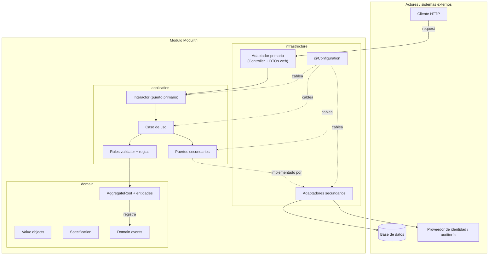
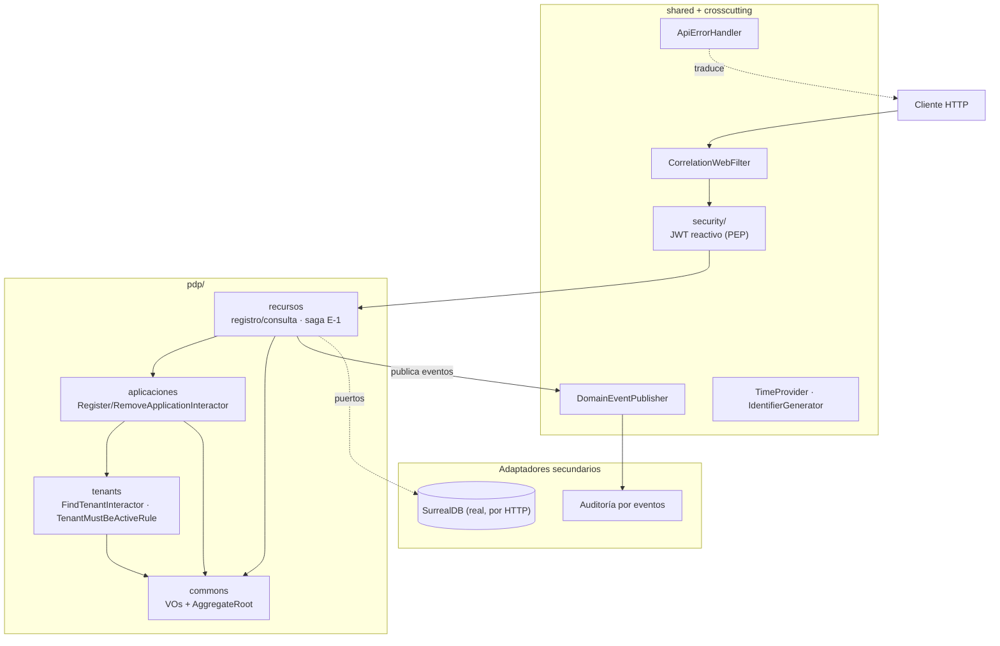

# Arquitectura objetivo y hoja de ruta

[← Planes](.) ·
[Gobierno (ADR)](https://github.com/Seguridad-UCO/security-platform-architecture/blob/main/docs/01-governance/adr/README.md) ·
[Diagramas C4](https://github.com/Seguridad-UCO/security-platform-architecture/blob/main/docs/03-architecture/c4/README.md)

## Contexto

Hoja de ruta de evolución de `securityBaseline`: Clean Architecture + hexagonal por módulo sobre
Spring Modulith, stack reactivo (WebFlux). Las decisiones grandes están en
[gobierno](https://github.com/Seguridad-UCO/security-platform-architecture/blob/main/docs/01-governance/adr/README.md)
(ADR-016 a ADR-019).

Regla invariante: `domain/` y `application/` no cambian cuando entran seguridad o persistencia
reales — solo se añaden o sustituyen adaptadores en `infrastructure/`.

## Arquitectura por módulo



**Dependencias:** `infrastructure → application → domain`. Los puertos secundarios se declaran en
`application` y se implementan en `infrastructure`. El dominio no importa Spring ni Reactor.

### Plantilla de carpetas por módulo

```text
<módulo>/
├── domain/                            entidades, AggregateRoot, VOs, specifications, eventos
├── application/
│   ├── model/                         contextos de aplicación (p. ej. hechos compuestos para reglas)
│   ├── usecase/ (+ impl)              orquestación (Reactor); devuelve dominio cuando aplica
│   ├── port/
│   │   ├── primary/
│   │   │   ├── dto/{request,response}
│   │   │   ├── mapper/                proyección dominio → DTO de salida
│   │   │   └── interactor/ (+ impl)   un contrato por operación; mapea y ejecuta el caso de uso
│   │   └── secondary/                 Repository · EventPublisher · TransactionPort
│   ├── rule/ + rulesvalidator/
│   └── exception/
└── infrastructure/
    ├── config/                        @Configuration (DI manual)
    └── adapter/
        ├── primary/web/               controller + dto/request/raw + mapper
        └── secondary/                 persistence · audit · transaction
```

## Estructura del contenedor PDP



Invariante Modulith (`ModulithStructureTests`):
`aplicaciones → commons, tenants` y `recursos → commons, tenants, aplicaciones`.

## Flujo de una operación HTTP

```text
SecurityWebFilterChain (JWT) → Controller → Interactor.execute(raw)
                                               ├─ SecurityContext.currentPrincipal() → tenant
                                               ├─ mapea raw + tenant → DTO tipado
                                               ├─ UseCase.execute(dto)
                                               │    ├─ RulesValidator → Rules
                                               │    └─ orquestación / puertos secundarios → dominio
                                               └─ proyecta dominio → respuesta HTTP
Controller  →  ApiResponse
```

Cada interactor y cada caso de uso extiende una forma genérica
(`ReactiveOperation` / `ReactiveOperationWithoutResult`) y declara un solo método `execute`. El
tenant nunca es un parámetro de esa forma genérica: el interactor lo lee del principal autenticado
(ADR-0003) antes de construir el DTO, así que ni el contrato del puerto ni el caso de uso saben que
existe un JWT.

## Qué se mantiene / incorpora / retira

| Acción     | Elemento                                                                                                                                                                                                                           |
|------------|------------------------------------------------------------------------------------------------------------------------------------------------------------------------------------------------------------------------------------|
| Mantener   | Clean+Hexagonal por módulo Modulith; DI manual en `@Configuration`                                                                                                                                                                 |
| Mantener   | VOs auto-validados; Specification; motor de reglas                                                                                                                                                                                 |
| Mantener   | Entrada String→VO sin `starter-validation`; `ApiErrorHandler` RFC7807                                                                                                                                                              |
| Mantener   | Capa interactor ([ADR-016](https://github.com/Seguridad-UCO/security-platform-architecture/blob/main/docs/01-governance/adr/ADR-016-interactor-layer.md))                                                                          |
| Incorporar | `AggregateRoot` + eventos ([ADR-017](https://github.com/Seguridad-UCO/security-platform-architecture/blob/main/docs/01-governance/adr/ADR-017-domain-events-application-event-publisher.md)) — hecho                               |
| Incorporar | Spring Security reactivo + JWT ([ADR-018](https://github.com/Seguridad-UCO/security-platform-architecture/blob/main/docs/01-governance/adr/ADR-018-jwt-reactive-security-implementation.md)) — hecho                               |
| Incorporar | Persistencia SurrealDB ([ADR-019](https://github.com/Seguridad-UCO/security-platform-architecture/blob/main/docs/01-governance/adr/ADR-019-surrealdb-implementation.md)) — hecho                                                   |
| Retirado   | Fachadas multi-método (`*ModuleApi` / `*Service`); DTO de registro duplicado; `tenantId` en el cuerpo/query (ahora viene del token); `ReactiveTransactionPort`/`SnapshotCapable` (ahora saga con compensación explícita, ADR-0004) |

## Etapas

Cada etapa deja `./mvnw verify` en verde (compilación, fronteras Modulith, tests, cobertura).

| Etapa | Contenido                                                                                                   | Estado     |
|-------|-------------------------------------------------------------------------------------------------------------|------------|
| 0     | ADRs, C4, convención de idioma                                                                              | Completada |
| 1     | Colapso DTO duplicado; puerto `SnapshotCapable`                                                             | Completada |
| 2     | Eventos de dominio + auditoría por listener                                                                 | Completada |
| —     | Interactores por operación; mapeo en interactor; reglas de tenant separadas                                 | Completada |
| 3     | Seguridad real (PEP JWT); tenant retirado del cuerpo/query                                                  | Completada |
| 4     | Persistencia SurrealDB (HTTP + WebClient, sin driver Java); saga con compensación explícita; Testcontainers | Completada |
| 5     | Sincronización final de documentación y evidencia                                                           | Completada |

## Verificación

- `./mvnw verify` — el POM y el pipeline usan Java 25.
- `ApplicationModules.of(PdpApplication.class).verify()` — fronteras Modulith.
- Tests de `domain/` y `application/` sin levantar Spring.
- Eventos: `ProtectedResourceAuditListenerTests`.
- Seguridad: `SecurityWebFilterChainTests` (401/403, rutas públicas) y `ProtectedApplicationHttpTests`
  (flujo autenticado, aislamiento entre tenants).
- Etapa 4: Testcontainers con SurrealDB — `AbstractSurrealDbIntegrationTest` (contenedor único
  compartido por la JVM de prueba) y `SurrealRepositoryIntegrationTests` (los tres repositorios
  reales, sin contexto de Spring). `./mvnw verify` es autocontenido: no requiere `docker compose up`
  manual, solo Docker corriendo.
