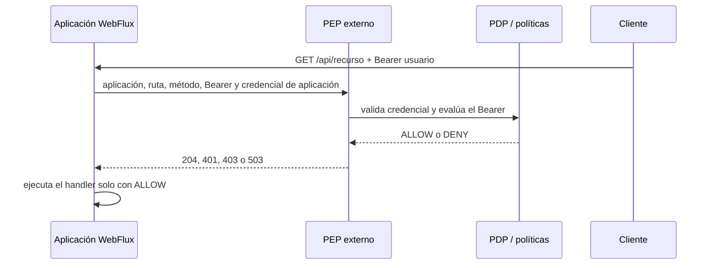

# Guía de integración — starter Spring Boot WebFlux

Este starter instala un filtro WebFlux que protege por defecto las rutas de una aplicación sin que el equipo
añada filtros, anotaciones ni modifique sus controladores. Cada solicitud protegida conserva el Bearer del
usuario y el starter pide una decisión al PEP; el PEP valida la credencial de la aplicación y consulta al PDP.

## Cómo funciona



No hay proxy ni ruta pública alternativa: el cliente llama a la URL normal del backend y el filtro impide que
llegue al controlador mientras no exista una decisión `ALLOW`. El PEP no confía en el `application-id` por sí
solo: valida la credencial emitida para esa aplicación por el PDP.

El starter **no** administra recursos, roles, perfiles, tenants ni políticas. El equipo debe configurarlos en el
sistema central. Mientras un recurso no tenga una decisión disponible en el PDP, el acceso falla cerrado.

## Requisitos

- Aplicación Java 25 con Spring Boot 4.1 y WebFlux.
- PEP desplegado y accesible por HTTPS.
- Backend accesible únicamente desde la red privada del PEP.
- Un `application-id` emitido por el PDP, entorno, audiencia JWT y la credencial de aplicación que el PDP
  mostró una única vez al registrarla.
- PEP configurado con issuer, JWKS, conexión al PDP y una ruta persistente para integraciones.

## 1. Preparar el PEP

El administrador configura el PEP para validar la credencial contra el PDP por mTLS. El PEP no guarda hashes ni
secretos de aplicaciones: el secreto en texto plano solo se entrega una vez al equipo de la aplicación al
registrarla en el PDP y debe almacenarse como secreto de despliegue.

```properties
pep.integration.enabled=true
pep.integration.registry-file=/var/lib/security-pep/integrations.json
pep.integration.public-base-url=https://security.example.org
pep.pdp.service-identity.token-uri=${PEP_KEYCLOAK_TOKEN_URI}
pep.pdp.service-identity.client-id=${PEP_KEYCLOAK_CLIENT_ID}
pep.pdp.service-identity.client-secret=${PEP_KEYCLOAK_CLIENT_SECRET}
```

El archivo `integrations.json` debe estar en un volumen privado, con permisos de lectura y escritura para el
proceso PEP. Esta versión usa un archivo local: ejecutar una sola réplica del PEP. No usar múltiples réplicas
con archivos independientes porque cada una tendría rutas diferentes.

El endpoint técnico del PEP es interno:

```text
PUT /internal/v1/integrations/{application-id}/{environment}
Authorization: Bearer <credencial-de-aplicacion-emitida-por-el-PDP>
```

El firewall o ingress debe permitirlo solo desde las redes de aplicaciones autorizadas. El PEP valida el secreto
con el PDP para el `application-id` recibido; una credencial no puede registrar otra aplicación.

## 2. Instalar el starter localmente

Desde este repositorio:

```sh
./mvnw -f pep/starter/pom.xml install
```

Esto instala el artefacto en el repositorio Maven local. En la aplicación consumidora, añadir:

```xml
<dependency>
  <groupId>co.edu.uco</groupId>
  <artifactId>security-pep-integration-spring-boot-starter</artifactId>
  <version>0.1.0-SNAPSHOT</version>
</dependency>
```

## 3. Configurar la aplicación

En `application.properties` o mediante variables de entorno equivalentes:

```properties
security.enabled=true
security.pep.enforcement.enabled=true
security.pep.enforcement.pep-url=https://security.example.org
security.pep.enforcement.application-id=${PDP_APPLICATION_ID}
security.pep.enforcement.environment=prod
security.pep.enforcement.application-credential=${PDP_APPLICATION_CREDENTIAL}
# Solo estas rutas omiten la autorización. Si se omite, no hay rutas públicas.
security.pep.enforcement.public-paths=/actuator/health
```

`PDP_APPLICATION_CREDENTIAL` debe ser la credencial emitida por el PDP, no un token creado ni almacenado por el
PEP. Para una demostración estrictamente local se permite `http` solo al declarar explícitamente:

```properties
security.pep.enforcement.allow-insecure-http=true
```

No usar esa propiedad en producción.

La integración se puede apagar completamente para un entorno local o una contingencia controlada:

```properties
security.enabled=false
```

Con `security.enabled=false` el starter no instala el filtro. Si la propiedad no está presente, su valor efectivo
es `true`. En producción no se debe apagar: una configuración incompleta hace fallar el arranque, y un PEP/PDP no
disponible responde `503`, nunca permite el handler.

## Comportamiento ante errores

- Sin Bearer válido, la aplicación responde `401`.
- Si el PDP deniega el recurso, responde `403`.
- Si PEP/PDP no está disponible o su respuesta es inválida, responde `503`.
- Una ruta incluida explícitamente en `public-paths` no consulta al PEP.

## Uso por clientes

Los clientes consumen la URL normal de la aplicación, por ejemplo
`https://academic.example/api/v1/courses`, e incluyen `Authorization: Bearer <access-token>`.

## Límites de la primera versión

- Solo Spring Boot WebFlux; no hay starter MVC ni SDK para otros lenguajes.
- Una sola réplica PEP para registros dinámicos persistidos en archivo.
- El canal PEP→PDP requiere una identidad técnica del PEP y mTLS en producción; no se sustituye por el Bearer del
  usuario ni por la credencial de la aplicación.
