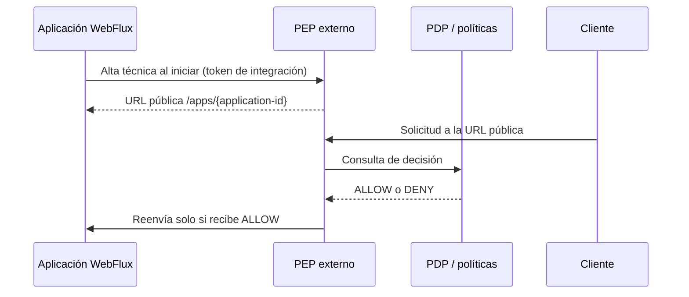

# Guía de integración — starter Spring Boot WebFlux

Este starter permite que una aplicación WebFlux se dé de alta técnicamente ante el PEP sin que el equipo tenga
que añadir filtros, anotaciones ni modificar sus controladores. El PEP sigue siendo el punto que intercepta y
protege las solicitudes.

## Cómo funciona



El starter registra el origen privado del backend, su audiencia JWT, el identificador de la aplicación y el
entorno. El PEP crea la ruta pública `https://<pep>/apps/<application-id>` y persiste el registro localmente.
Todas las rutas bajo ese prefijo pasan por el PEP.

El starter **no** administra recursos, roles, perfiles, tenants ni políticas. El equipo debe configurarlos en el
sistema central. Mientras un recurso no tenga una decisión disponible en el PDP, el acceso falla cerrado.

## Requisitos

- Aplicación Java 25 con Spring Boot 4.1 y WebFlux.
- PEP desplegado y accesible por HTTPS.
- Backend accesible únicamente desde la red privada del PEP.
- Un `application-id`, entorno, audiencia JWT y token opaco entregados por el administrador del PEP.
- PEP configurado con issuer, JWKS, conexión al PDP y una ruta persistente para integraciones.

## 1. Preparar el PEP

El administrador habilita el registro técnico y guarda un hash BCrypt del token por aplicación y entorno. El
token en texto plano solo se entrega una vez al equipo de la aplicación y debe almacenarse como secreto de
despliegue.

```properties
pep.integration.enabled=true
pep.integration.registry-file=/var/lib/security-pep/integrations.json
pep.integration.public-base-url=https://security.example.org

pep.integration.credentials[0].application-id=academic
pep.integration.credentials[0].environment=prod
pep.integration.credentials[0].token-hash=$2a$<hash-bcrypt-del-token>
```

El archivo `integrations.json` debe estar en un volumen privado, con permisos de lectura y escritura para el
proceso PEP. Esta versión usa un archivo local: ejecutar una sola réplica del PEP. No usar múltiples réplicas
con archivos independientes porque cada una tendría rutas diferentes.

El endpoint técnico del PEP es interno:

```text
PUT /internal/v1/integrations/{application-id}/{environment}
Authorization: Bearer <token-opaco>
```

El firewall o ingress debe permitirlo solo desde las redes de aplicaciones autorizadas. El token solo puede
actualizar su propia pareja de aplicación y entorno.

## 2. Instalar el starter localmente

Desde este repositorio:

```sh
./mvnw -f pep/starter/pom.xml install
```

Esto instala el artefacto en el repositorio Maven local. En la aplicación consumidora, añadir:

```xml
<dependency>
  <groupId>co.edu.uco</groupId>
  <artifactId>security-pep-integration-spring-boot-starter</artifactId>
  <version>0.1.0-SNAPSHOT</version>
</dependency>
```

## 3. Configurar la aplicación

En `application.properties` o mediante variables de entorno equivalentes:

```properties
security.pep.registration.enabled=true
security.pep.registration.pep-url=https://security.example.org
security.pep.registration.application-id=academic
security.pep.registration.environment=prod
security.pep.registration.backend-url=https://academic.internal
security.pep.registration.audience=academic-api
security.pep.registration.token=${PEP_REGISTRATION_TOKEN}
```

Para una demostración estrictamente local se permite `http` solo al declarar explícitamente:

```properties
security.pep.registration.allow-insecure-http=true
```

No usar esa propiedad en producción.

La integración se puede apagar completamente para un entorno local o una contingencia controlada:

```properties
security.enabled=false
```

Con `security.enabled=false` el starter no crea el `ApplicationRunner`, no registra ni reintenta contra el
PEP. Si la propiedad no está presente, su valor efectivo es `true`. La propiedad correcta es
`security.enabled` (no `security.eneble`). También debe permanecer en `true`
`security.pep.registration.enabled` para que haya alta técnica.

Este interruptor **no instala ni retira seguridad dentro de los controladores del backend**, porque este
starter no es un filtro de autorización local: la protección se materializa al publicar el backend solamente
por el PEP. Por ello, al apagarlo se debe mantener la restricción de red que impide el acceso directo al
backend; de otro modo se puede eludir el PEP.

`backend-url` debe ser un origen sin path, query, fragmento ni credenciales. En producción debe usar HTTPS; HTTP
solo se permite si el PEP fue configurado explícitamente para desarrollo. La URL debe ser alcanzable desde el
PEP, no necesariamente desde Internet.

Al iniciar, el starter llama al PEP y registra o actualiza la integración. Un registro exitoso deja un log similar
a `PEP integration active: publicBaseUrl=https://security.example.org/apps/academic`.

## Comportamiento ante errores

- Si el PEP no responde o devuelve 5xx, la aplicación inicia y reintenta con backoff entre 1 y 60 segundos.
- Si la configuración local es inválida o el PEP devuelve 4xx, la aplicación inicia y deja un error sanitizado en
  el log. Corregir la configuración o el token y reiniciar la aplicación.
- Si la aplicación aún no está registrada, el PEP responde `404 ROUTE_NOT_FOUND` al cliente.
- Si existe la ruta pero el PDP no puede tomar una decisión, el PEP falla cerrado según su contrato actual.

## Uso por clientes

Los clientes no consumen el backend privado directamente. Deben usar la URL pública del PEP:

```text
https://security.example.org/apps/academic/api/v1/courses
```

El PEP elimina el prefijo `/apps/academic` antes de reenviar la solicitud, por lo que el backend recibe:

```text
/api/v1/courses
```

Las rutas de salud públicas pertenecen al PEP (`/actuator/health`, `/actuator/health/liveness` y
`/actuator/health/readiness`). La salud de cada backend se supervisa dentro de su red privada.

## Límites de la primera versión

- Solo Spring Boot WebFlux; no hay starter MVC ni SDK para otros lenguajes.
- Una sola réplica PEP para registros dinámicos persistidos en archivo.
- El starter no reenvía tráfico ni instala autenticación local: el PEP externo conserva esas responsabilidades.
- El PDP actual debe implementar el contrato de decisión para que los recursos configurados puedan autorizarse.
- Si el PDP no está disponible o todavía no implementa el contrato, una llamada a la URL pública del PEP falla
  cerrada con `503`; nunca llega al backend. La alta técnica de una aplicación puede completar antes porque no
  evalúa políticas.
